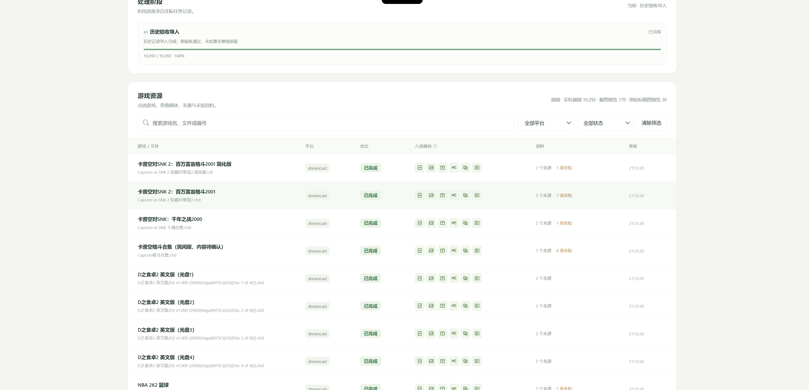

# TubeLiu 的刮削器 · TubeLiu’s Scraper

ES-DE默认携带的刮削器存在很多制约，特别是对于中文玩家不够友好，例如：

- **无法识别中文rom**：如果游戏rom文件是中文，就无法识别和准确刮削游戏数据。
- **刮削结果高度依赖文件名**：如果rom文件名没写对，没用英文全名，往往不会得到正确的结果。
- **数据不够完整**：通过ES-DE默认的screenscraper和thegamedb刮削出来的数据都是英文的，部分游戏数据不完整，缺少中文名称、简介、封面、截图、标题图、标识和视频。
- **结果不直观**：只在刮削结束告诉你一个统计数字。具体解决需要你自己回到游戏列表查看。
- **缺少新主机数据**：对于Switch等现代主机，数据不够完整。
- **天马整合包原数据存在错漏**：很多玩家拿到的ES-DE整合包都是基于天马G整合包转换出来的。这些整合包里原本的数据也并不完全准确。

TubeLiu’s Scraper 让 AI 帮你整理 ES-DE 的游戏资料和媒体。适用于安卓手机、平板、掌机，以及电脑上的 ES-DE 游戏库。

- **补齐资料和素材**：通过全网检索，多数据来源加上AI整理，多方面补齐中文名称、简介、封面、截图、标题图、标识和视频。
- **保留游玩记录**：保护收藏、游玩次数和时间，修改前备份，支持恢复和继续处理。
- **看得见的进度**：网页实时展示处理状态、来源和缺项，电脑与同一 Wi-Fi 下的手机都能查看。
- **直观查看结果**：点开游戏即可阅读完整资料、放大图片和播放视频。

只处理游戏资料与媒体，不下载游戏 ROM。新资料和媒体写入前会核对游戏文件的实际内容；无法确认匹配的条目保留待确认。

## 安装与使用

把这句话发给 AI：

> 帮我安装这个 skill：https://github.com/TubeLiu/tubeliu-scraper

安装后，直接说你想做什么，例如：

> 用 TubeLiu 的刮削器，帮我的安卓掌机补齐 ES-DE 的中文资料、封面、截图和视频。保留游玩记录，并给我一个工作台链接。

也可以只处理某个平台、检查已有资源或修复 gamelist。AI 会确认设备和处理范围，完成准备并打开工作台。工作台链接自动生成，无需申请访问令牌。

已内置 Windows（Intel/AMD 64 位）和 macOS（Intel/Apple 芯片）版 ADB 及必要依赖，AI 自动选择并检查。用户无需预先安装 ADB、配置 PATH，也无需首次运行时下载 ADB。平板或掌机仍需开启 USB 调试，并允许这台电脑连接。

## ScreenScraper 账号

在 [官方注册页面](https://www.screenscraper.fr/membreinscription.php) 创建账号，然后告诉 AI 你要配置这个账号。AI 会引导你在本机安全输入账号和密码并保存，下次自动使用。若当前接口还需额外授权，AI 会提示下一步。

没有可用的服务配置，也能扫描、预览、整理已有资源、修复路径和备份。当前自动写入新资料与媒体需要精确匹配凭证；查不到、版本不符或身份不明确的游戏会保留待确认。
